<p align="center">
  
</p>

<p align="center">
  <a href="https://ijlalahmad.dev">Portfolio</a> &nbsp;·&nbsp;
  <a href="https://blogs.ijlalahmad.dev">Blog</a> &nbsp;·&nbsp;
  <a href="https://www.linkedin.com/in/thre4dripper/">LinkedIn</a> &nbsp;·&nbsp;
  <a href="https://leetcode.com/thre4dripper">LeetCode</a> &nbsp;·&nbsp;
  <a href="mailto:ijlalahmad845@gmail.com">ijlalahmad845@gmail.com</a>
</p>

<p align="center">
  
</p>

---



I build platforms, tools, and the servers they run on — currently **Associate AI Consultant at GUS Global**, architecting the group's first AI-native platform for one of the world's largest higher-education networks.

- 🧠 Working on **agentic workflows, LLM integrations, and multi-tenant AI platforms**
- 🏗️ Before this: **Kenverse** (KAI — chat & voice agents, Casbin PBAC, white-labeled tenancy), **S&P Global** (iLevel notification microservices, Lambda → ECS, Splunk, S3 pipelines), **Bea Brand** (B2B SaaS, Kafka + FCM, S3 cloud drive)
- 🕹️ Off the clock I build **worlds and dev tools** — an infinite Three.js castle, a canvas design app, a terminal download manager in Go
- 🏠 Runs a **Raspberry Pi homelab** with better uptime than my sleep schedule
- 🏆 **Smart India Hackathon 2023 winner** (Medusa — AI-proctored exam portal), 2022 finalist, 500+ LeetCode problems
- ✍️ I write regularly at [blogs.ijlalahmad.dev](https://blogs.ijlalahmad.dev)
- ⚡ Fun fact: 2 hours of debugging can save you 5 minutes of reading the docs

<br clear="right" />

---

## 📈 Six years, plotted

<p align="center">
  
</p>

<p align="center">
  
  
</p>

<p align="center">
  
</p>

<p align="center">
  
</p>

> Every card above is generated by [`scripts/generate-cards.mjs`](scripts/generate-cards.mjs) and committed
> into this repo by a [nightly workflow](.github/workflows/cards.yml) — no third-party card service to go
> dark on me. [How it works ↓](#-how-this-readme-builds-itself)

---

## 🛠️ What I've built

**Worlds & interfaces**

| Project | What it is |
| --- | --- |
| [🏮 Infinity Castle](https://github.com/Thre4dripper/Infinity-Castle-ThreeJs) | An infinite, self-assembling Japanese castle you fly through as a crow. Procedural architecture, weather, sound — zero art assets. Pure Three.js. [Fly it →](https://thre4dripper.github.io/Infinity-Castle-ThreeJs/) |
| [🎨 Boardy](https://github.com/Thre4dripper/Boardy-WebApp) | A drawing and design app built on the Canvas API — shapes, freehand, transforms, export. Next.js. [Draw on it →](https://boardy.ijlalahmad.dev/) |
| [✈️ Portfolio](https://github.com/Thre4dripper/Portfolio) | A portfolio you fly through: five acts, twelve interactive scenes, zero framework JS. Astro + vanilla TS. [Take off →](https://ijlalahmad.dev) |

**Developer tools**

| Project | What it is |
| --- | --- |
| [🌊 tidefetch](https://github.com/Thre4dripper/tidefetch) | Keyboard-first terminal UI for the aria2 download engine, in Go. The same binary serves a web UI for headless boxes, and installs from my own [Homebrew tap](https://github.com/Thre4dripper/homebrew-tap). [Docs →](https://thre4dripper.github.io/tidefetch/) |
| [⚙️ NodeTs Express Service Template](https://github.com/Thre4dripper/NodeTs-Express-Service-Based-Template) | Production-grade Node + TS service: Sequelize, Mongoose, sockets, cron, gRPC, Redis, Docker, Swagger. |
| [📦 node-server-init](https://www.npmjs.com/package/node-server-init) | npm scaffolder that spins up a configured Node server in one command. 42 releases and counting. |
| [🎛️ express-master-controller](https://www.npmjs.com/package/express-master-controller) | Master-controller pattern for Express — APIs and sockets, defined fast. |
| [🤖 play-console-info](https://github.com/marketplace/actions/play-console-info) | Pull tracks, APKs, bundles, and listings from Google Play Console — as a GitHub Action or a native CLI binary. |
| [🔁 Reusable Atomic Workflows](https://github.com/Thre4dripper/Reusable-Atomic-Workflows) | Composable GitHub Actions for CI/CD, quality gates, docs, and deploys. |

**Apps, infrastructure & fundamentals**

| Project | What it is |
| --- | --- |
| [📚 DSA Programs](https://github.com/Thre4dripper/DSA-Programs) | My most-starred repo: data structures and algorithms in C++, every one documented with ASCII diagrams. |
| [🏠 Home Server Lab](https://github.com/Thre4dripper/Home-Server-Lab) | Self-hosted stack for Raspberry Pi and single-board machines — k3s, Docker, cert-manager, ArgoCD. |
| [🧮 Matscape](https://play.google.com/store/apps/details?id=com.ByteMechanics.matscape) | Matrix calculator on the Play Store — multiple matrices, step-by-step operations. [Source →](https://github.com/Thre4dripper/Matscape-AndroidApp) |
| [💬 Chit-Chat](https://chit-chat.ijlalahmad.dev/) | Real-time chat, twice over: [Kotlin + Compose](https://github.com/Thre4dripper/Chit-Chat-AndroidApp) and [React 19 + Firebase](https://github.com/Thre4dripper/Chit-Chat-WebApp), sharing one backend. |

---

## 💻 Tech Stack

**Languages**

                

**Frontend**

                    

**Mobile**

    

**Backend & APIs**

               

**AI & Agents**

       

**Databases & ORMs**

               

**Cloud & Hosting**

        

**DevOps & Observability**

        

**Build, Package & Quality**

         

**Version Control & Workflow**

      

**Systems & Hardware**

    

**Design & Creative**

     

**Off the clock**

      

---

## 🐍 Contributions

<picture>
  
</picture>

---

## 🔧 How this README builds itself

Most profile READMEs rent their stats from somebody else's free Vercel deployment. When that deployment
goes away, the profile fills up with broken images. So this one hosts its own.

```
scripts/
  generate-cards.mjs      entry point — fetch, render, write assets/
  lib/palette.mjs         one set of design tokens, shared by every card
  lib/svg.mjs             card chrome, odometer counters, path smoothing
  lib/data.mjs            the four data sources, cached and fault-tolerant
  cards/*.mjs             one module per SVG
```

| | |
| --- | --- |
| **Data** | GitHub REST (profile, repos, per-repo language bytes) · the public contribution calendar · LeetCode GraphQL · the npm registry |
| **Render** | Hand-written SVG. CSS keyframes and SMIL only — both animate inside an `` on GitHub, where scripts and webfonts do not |
| **Refresh** | A [nightly Action](.github/workflows/cards.yml) re-renders and commits anything that changed |
| **Failure** | Each source is isolated. If LeetCode is down, that one card keeps yesterday's SVG and the rest still update |
| **Dependencies** | None. Zero `npm install`, just Node's built-in `fetch` |

Run it yourself:

```bash
node scripts/generate-cards.mjs           # fetch fresh, rewrite assets/
node scripts/generate-cards.mjs --cache   # reuse scripts/.cache, work offline
```

<p align="center"><sub>Contribution numbers are the ones GitHub itself reports. Language shares are real byte counts across every original repo — not a tally of each repo's single "primary language".</sub></p>
